# System Architecture Diagram

## High-Level Architecture

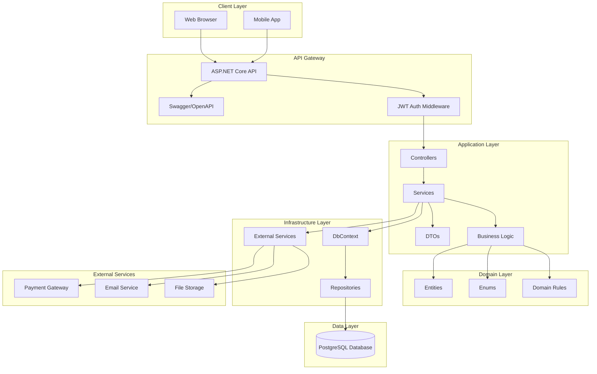

---

## Clean Architecture Layers

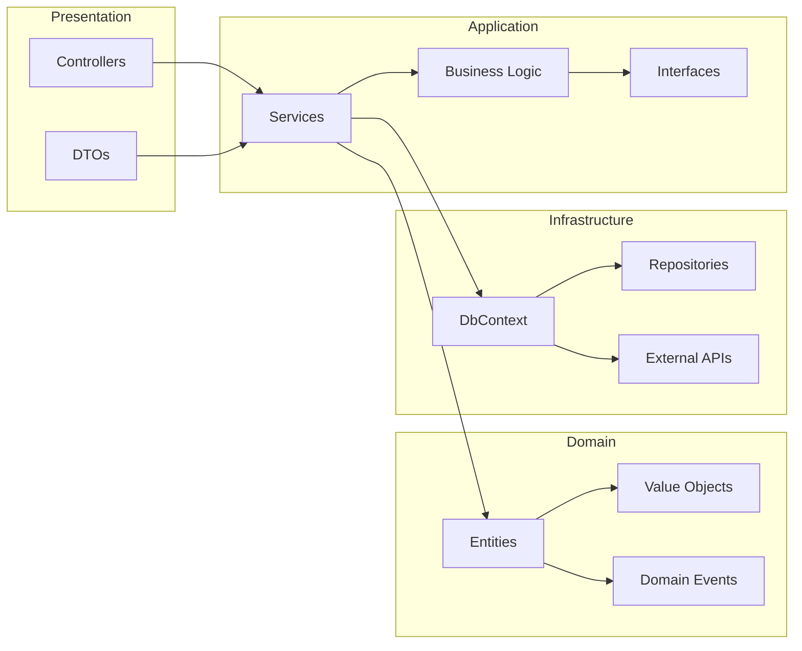

---

## Payment Flow Sequence

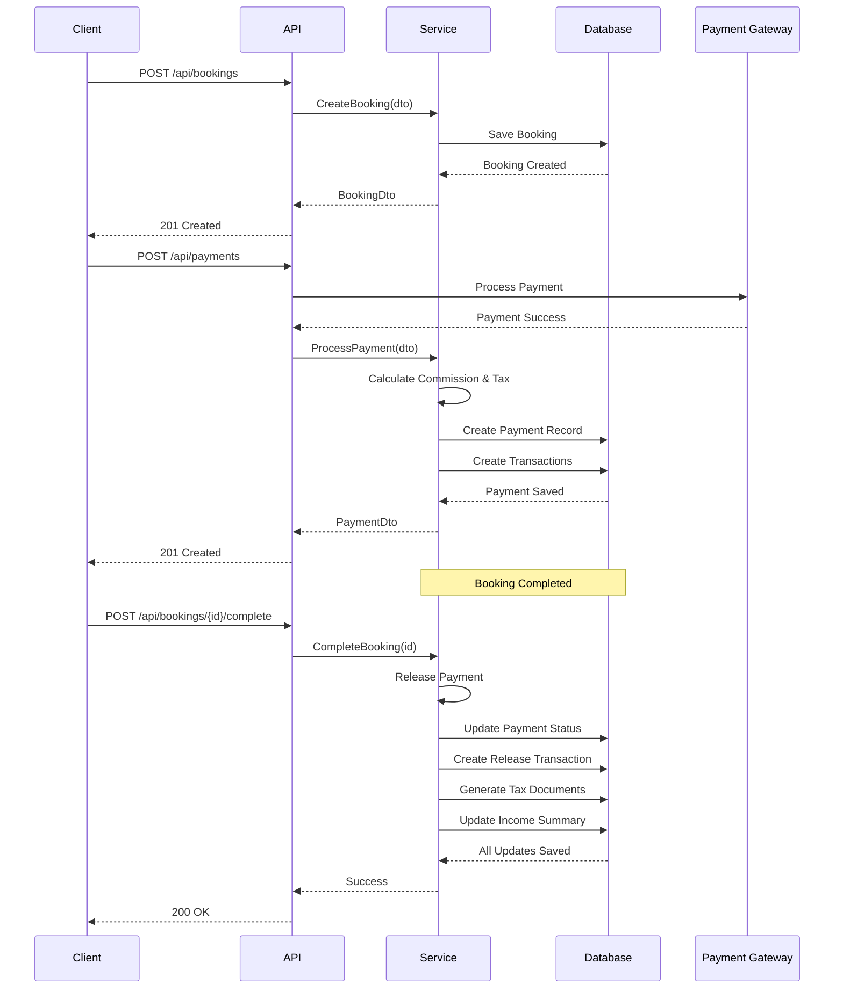

---

## Database Entity Relationships

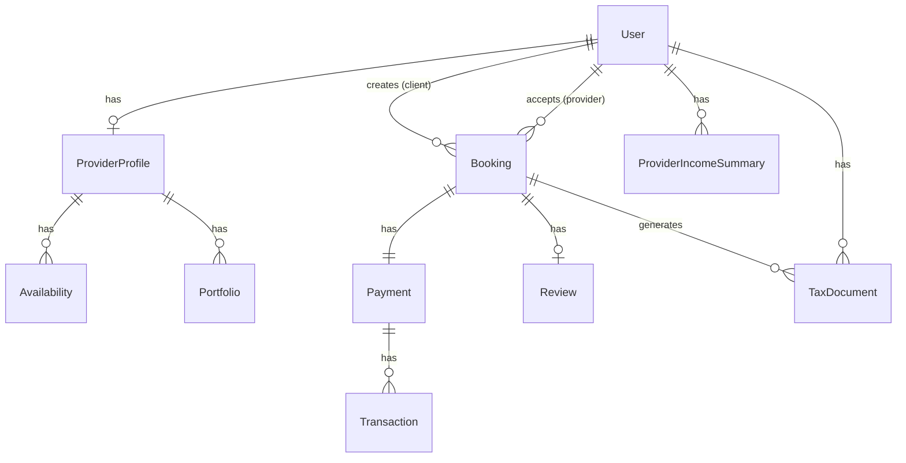

---

## Authentication Flow

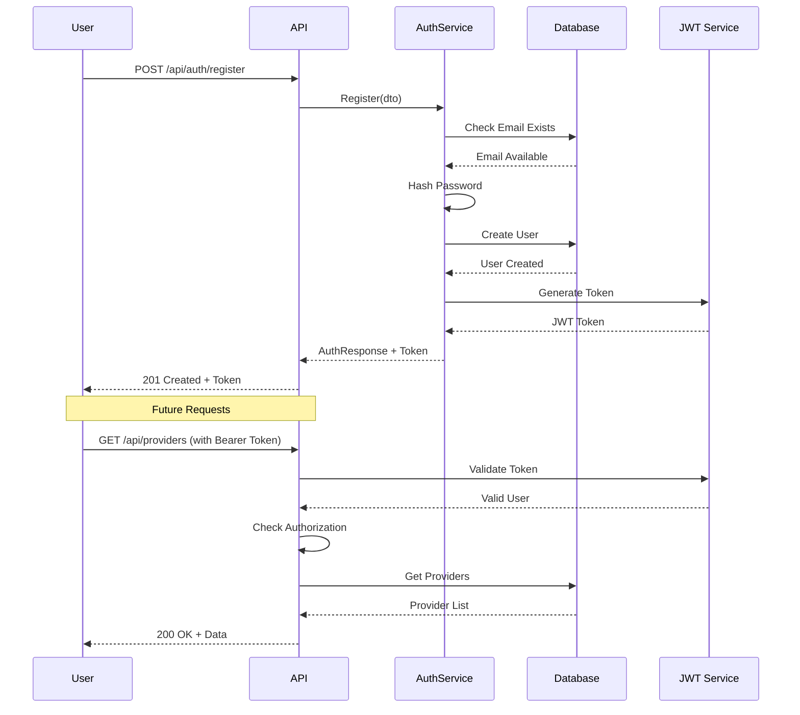

---

## Commission Calculation Flow

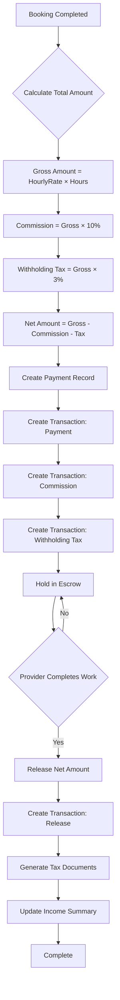

---

## Booking Status Lifecycle

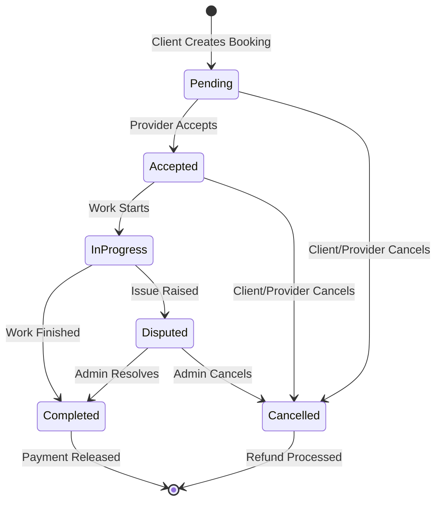

---

## API Request/Response Flow

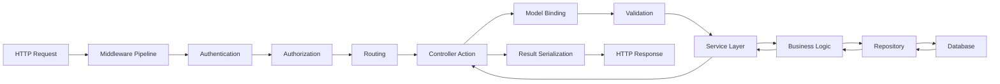

---

## Technology Stack Overview

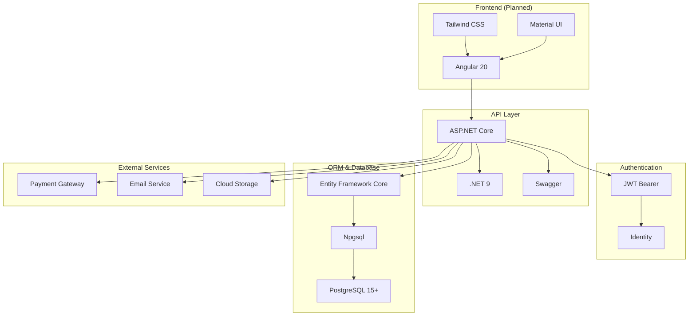

---

## Deployment Architecture (Planned)

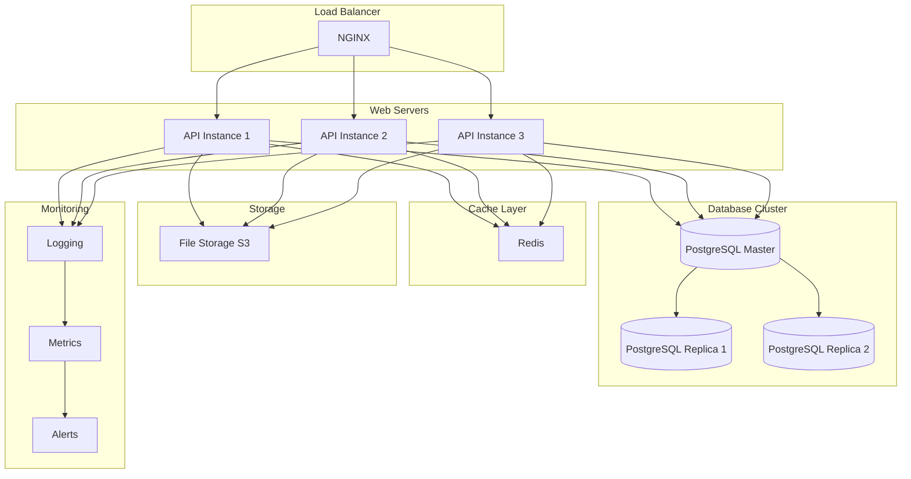

---

## Security Layers

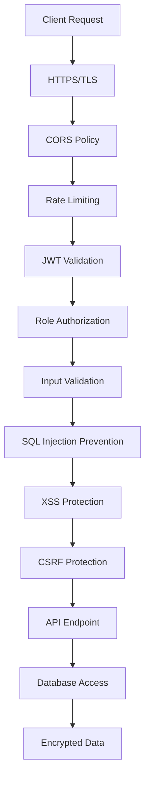

---

## Data Flow: Booking to Payment

```mermaid
flowchart LR
    A[Client Creates Booking] --> B[Booking Saved]
    B --> C[Provider Accepts]
    C --> D[Client Makes Payment]
    D --> E[Payment in Escrow]
    E --> F[Work in Progress]
    F --> G[Provider Completes]
    G --> H[System Calculates]
    H --> I[Commission Deducted]
    I --> J[Tax Deducted]
    J --> K[Net Amount Released]
    K --> L[Documents Generated]
    L --> M[Income Summary Updated]
    M --> N[Transaction Complete]
```

---

## Module Dependencies

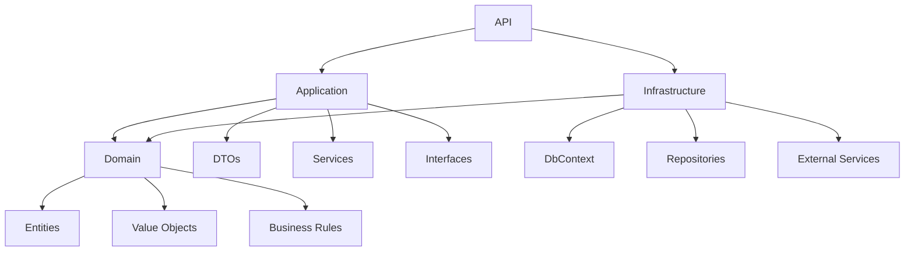

---

## Key Performance Indicators

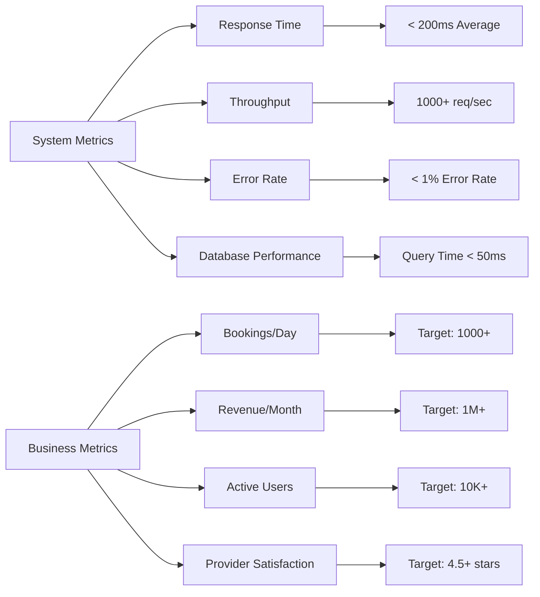

---

## API Gateway Pattern

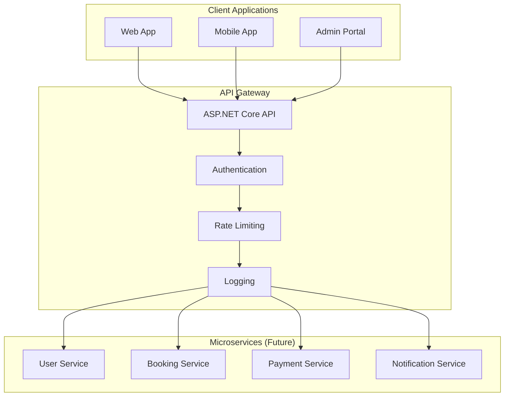

---

## Caching Strategy (Planned)

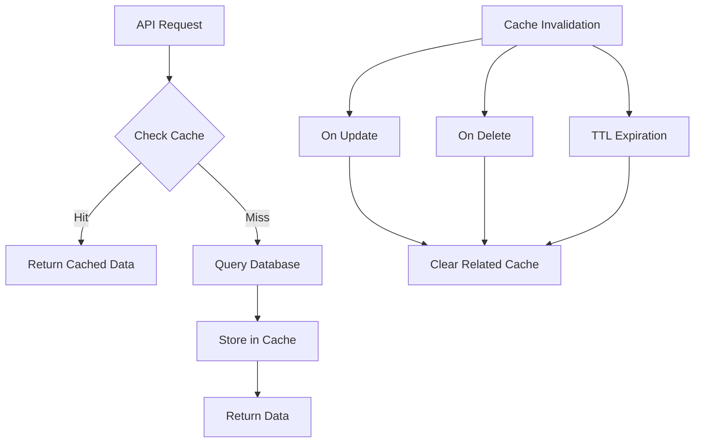

---

## Error Handling Flow

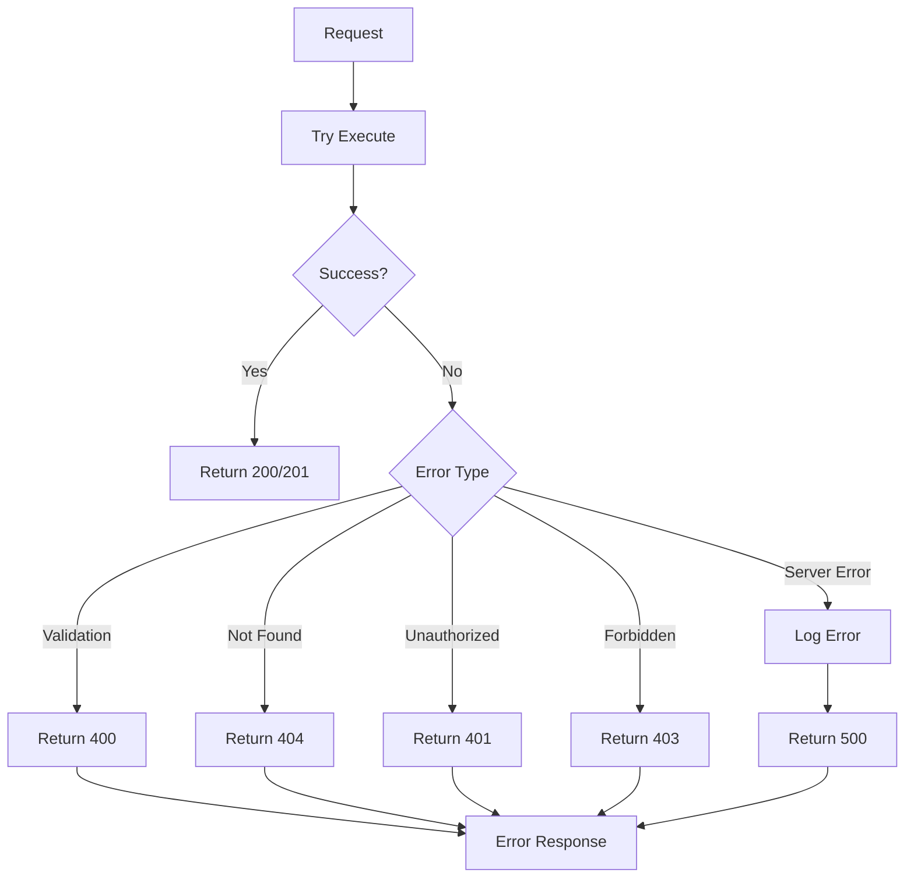
