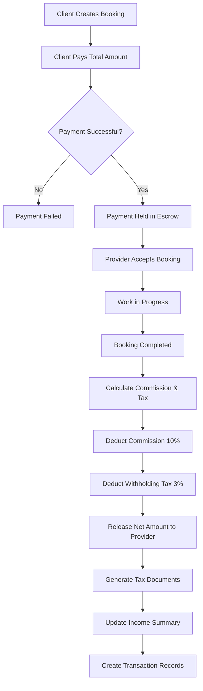

# Commission & Withholding Tax Calculation Flow

## Overview
This document explains how the platform calculates commission, withholding tax, and net income for providers in the Job Service Marketplace.

---

## Business Rules

### 1. Commission Rate
- **Platform Commission**: 10% of the total booking amount
- Charged to the Provider (deducted from their earnings)

### 2. Withholding Tax Rate
- **Thailand Withholding Tax (ภงด.3)**: 3% of the gross income
- Mandatory tax deduction for service providers
- Platform withholds this amount and remits to the government

### 3. Payment Flow
```
Client Payment → Escrow (Platform holds) → Commission Deduction → Tax Deduction → Net Payment to Provider
```

---

## Calculation Formula

### Step-by-Step Calculation

```
1. Gross Amount (Total Booking Amount)
   = HourlyRate × EstimatedHours
   
2. Platform Commission
   = Gross Amount × 10%
   
3. Taxable Amount
   = Gross Amount - Commission
   
4. Withholding Tax (ภงด.3)
   = Gross Amount × 3%
   
5. Net Amount (Provider Receives)
   = Gross Amount - Commission - Withholding Tax
```

### Alternative Simplified Formula
```
Net Amount = Gross Amount × (1 - 0.10 - 0.03)
           = Gross Amount × 0.87
           = Gross Amount × 87%
```

---

## Example Calculations

### Example 1: Standard Booking

**Booking Details:**
- Hourly Rate: ฿500
- Estimated Hours: 8 hours
- Total Amount: ฿4,000

**Calculation:**
```
Gross Amount:         ฿4,000.00
Commission (10%):     ฿400.00    (Platform keeps)
Withholding Tax (3%): ฿120.00    (Remitted to government)
Net Amount:           ฿3,480.00  (Provider receives)
```

**Verification:**
```
฿4,000 × 87% = ฿3,480 ✓
```

---

### Example 2: Half-Day Job

**Booking Details:**
- Hourly Rate: ฿300
- Estimated Hours: 4 hours
- Total Amount: ฿1,200

**Calculation:**
```
Gross Amount:         ฿1,200.00
Commission (10%):     ฿120.00
Withholding Tax (3%): ฿36.00
Net Amount:           ฿1,044.00
```

---

### Example 3: Full-Day Premium Service

**Booking Details:**
- Hourly Rate: ฿1,000
- Estimated Hours: 10 hours
- Total Amount: ฿10,000

**Calculation:**
```
Gross Amount:         ฿10,000.00
Commission (10%):     ฿1,000.00
Withholding Tax (3%): ฿300.00
Net Amount:           ฿8,700.00
```

---

## Payment Flow Diagram



---

## Detailed Payment Processing Flow

### 1. Booking Creation
```
Status: Pending
Payment Status: Pending
```

### 2. Client Payment
```csharp
// Client pays the total amount
decimal totalAmount = booking.HourlyRate * booking.EstimatedHours;

Payment payment = new Payment
{
    BookingId = booking.Id,
    Amount = totalAmount,
    Status = PaymentStatus.Pending,
    PaymentMethod = PaymentMethod.CreditCard
};
```

### 3. Payment Held in Escrow
```csharp
// After successful payment, money is held
payment.Status = PaymentStatus.Held; // In escrow
payment.PaidAt = DateTime.UtcNow;

// Create transaction record
Transaction paymentTransaction = new Transaction
{
    PaymentId = payment.Id,
    Type = TransactionType.Payment,
    Amount = totalAmount,
    Description = "Payment received from client",
    CreatedAt = DateTime.UtcNow
};
```

### 4. Booking Completion & Calculation
```csharp
// When booking is completed
booking.Status = BookingStatus.Completed;
booking.CompletedAt = DateTime.UtcNow;

// Calculate deductions
decimal commissionRate = 0.10m; // 10%
decimal withholdingTaxRate = 0.03m; // 3%

payment.CommissionAmount = payment.Amount * commissionRate;
payment.WithholdingTaxAmount = payment.Amount * withholdingTaxRate;
payment.NetAmount = payment.Amount - payment.CommissionAmount - payment.WithholdingTaxAmount;

// Create commission transaction
Transaction commissionTransaction = new Transaction
{
    PaymentId = payment.Id,
    Type = TransactionType.Commission,
    Amount = payment.CommissionAmount,
    Description = "Platform commission (10%)",
    CreatedAt = DateTime.UtcNow
};

// Create withholding tax transaction
Transaction taxTransaction = new Transaction
{
    PaymentId = payment.Id,
    Type = TransactionType.WithholdingTax,
    Amount = payment.WithholdingTaxAmount,
    Description = "Withholding tax 3% (ภงด.3)",
    CreatedAt = DateTime.UtcNow
};
```

### 5. Release Payment to Provider
```csharp
// Release net amount to provider
payment.Status = PaymentStatus.Released;
payment.ReleasedToProviderAt = DateTime.UtcNow;

// Create release transaction
Transaction releaseTransaction = new Transaction
{
    PaymentId = payment.Id,
    Type = TransactionType.Release,
    Amount = payment.NetAmount,
    Description = $"Payment released to provider (Net: {payment.NetAmount})",
    CreatedAt = DateTime.UtcNow
};
```

### 6. Generate Tax Documents
```csharp
// Generate PND3 document (ภงด.3 - Withholding Tax Certificate)
TaxDocument pnd3 = new TaxDocument
{
    ProviderId = booking.ProviderId,
    BookingId = booking.Id,
    DocumentType = TaxDocumentType.PND3,
    DocumentNumber = GeneratePND3Number(),
    DocumentUrl = GeneratePND3Pdf(booking, payment),
    Year = DateTime.UtcNow.Year,
    Amount = payment.WithholdingTaxAmount,
    IssuedDate = DateTime.UtcNow
};

// Generate Invoice
TaxDocument invoice = new TaxDocument
{
    ProviderId = booking.ProviderId,
    BookingId = booking.Id,
    DocumentType = TaxDocumentType.Invoice,
    DocumentNumber = GenerateInvoiceNumber(),
    DocumentUrl = GenerateInvoicePdf(booking, payment),
    Year = DateTime.UtcNow.Year,
    Amount = payment.Amount,
    IssuedDate = DateTime.UtcNow
};

// Generate Receipt
TaxDocument receipt = new TaxDocument
{
    ProviderId = booking.ProviderId,
    BookingId = booking.Id,
    DocumentType = TaxDocumentType.Receipt,
    DocumentNumber = GenerateReceiptNumber(),
    DocumentUrl = GenerateReceiptPdf(booking, payment),
    Year = DateTime.UtcNow.Year,
    Amount = payment.NetAmount,
    IssuedDate = DateTime.UtcNow
};
```

### 7. Update Provider Income Summary
```csharp
// Update or create income summary for the year
int year = DateTime.UtcNow.Year;
ProviderIncomeSummary summary = await GetOrCreateIncomeSummary(booking.ProviderId, year);

summary.TotalGrossIncome += payment.Amount;
summary.TotalCommission += payment.CommissionAmount;
summary.TotalWithholdingTax += payment.WithholdingTaxAmount;
summary.TotalNetIncome += payment.NetAmount;
summary.TotalCompletedBookings += 1;
summary.UpdatedAt = DateTime.UtcNow;
```

---

## Annual Income Summary Example

### Provider Annual Report (Year 2024)

```
Provider: John Doe (ID: 123)
Year: 2024

Total Completed Bookings: 50

Gross Income:           ฿250,000.00
Platform Commission:    ฿25,000.00   (10%)
Withholding Tax:        ฿7,500.00    (3%)
─────────────────────────────────────
Net Income:             ฿217,500.00  (87%)
```

---

## Tax Document Types

### 1. PND3 (ภงด.3) - Withholding Tax Certificate
- Official document certifying tax withheld
- Used for annual tax filing
- Shows amount withheld for each payment

### 2. Invoice
- Billing document for services rendered
- Shows gross amount charged
- Required for accounting purposes

### 3. Receipt
- Proof of payment received
- Shows net amount received by provider
- After all deductions

---

## Edge Cases & Business Logic

### 1. Refund Scenario
```csharp
if (booking.Status == BookingStatus.Cancelled && payment.Status == PaymentStatus.Paid)
{
    // Full refund to client
    payment.Status = PaymentStatus.Refunded;
    
    Transaction refundTransaction = new Transaction
    {
        PaymentId = payment.Id,
        Type = TransactionType.Refund,
        Amount = payment.Amount,
        Description = "Full refund to client",
        CreatedAt = DateTime.UtcNow
    };
    
    // No commission or tax charged on refunded bookings
}
```

### 2. Dispute Scenario
```csharp
if (booking.Status == BookingStatus.Disputed)
{
    // Payment remains in escrow
    payment.Status = PaymentStatus.Held;
    
    // No release until dispute is resolved by admin
    // Admin can decide: full payment, partial payment, or refund
}
```

### 3. Minimum Payment Threshold
```csharp
// Example: Provider can only withdraw if net amount >= ฿100
const decimal MINIMUM_PAYOUT = 100m;

if (payment.NetAmount < MINIMUM_PAYOUT)
{
    // Hold in account until threshold is met
    // Accumulate multiple bookings
}
```

---

## Database Queries for Income Summary

### Get Provider Annual Income
```sql
SELECT 
    p.Year,
    p.TotalGrossIncome,
    p.TotalCommission,
    p.TotalWithholdingTax,
    p.TotalNetIncome,
    p.TotalCompletedBookings
FROM ProviderIncomeSummaries p
WHERE p.ProviderId = @ProviderId
  AND p.Year = @Year;
```

### Get All Transactions for a Booking
```sql
SELECT 
    t.Type,
    t.Amount,
    t.Description,
    t.CreatedAt
FROM Transactions t
INNER JOIN Payments p ON t.PaymentId = p.Id
WHERE p.BookingId = @BookingId
ORDER BY t.CreatedAt;
```

### Get Tax Documents for a Provider
```sql
SELECT 
    td.DocumentType,
    td.DocumentNumber,
    td.Amount,
    td.IssuedDate,
    b.JobTitle
FROM TaxDocuments td
INNER JOIN Bookings b ON td.BookingId = b.Id
WHERE td.ProviderId = @ProviderId
  AND td.Year = @Year
ORDER BY td.IssuedDate DESC;
```
