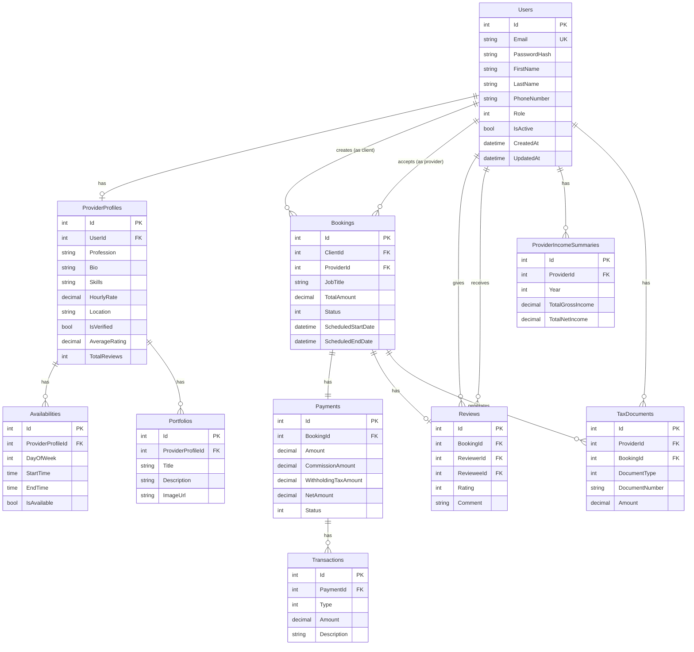

# Entity Relationship Diagram (ERD)

## Database Schema for Job Service Marketplace

### Tables Structure

#### 1. Users
```sql
CREATE TABLE Users (
    Id SERIAL PRIMARY KEY,
    Email VARCHAR(100) UNIQUE NOT NULL,
    PasswordHash TEXT NOT NULL,
    FirstName VARCHAR(50) NOT NULL,
    LastName VARCHAR(50) NOT NULL,
    PhoneNumber VARCHAR(20),
    Role INT NOT NULL, -- 1=Client, 2=Provider, 3=Admin
    IsActive BOOLEAN DEFAULT TRUE,
    CreatedAt TIMESTAMP NOT NULL DEFAULT NOW(),
    UpdatedAt TIMESTAMP NOT NULL DEFAULT NOW()
);

CREATE INDEX idx_users_email ON Users(Email);
CREATE INDEX idx_users_role ON Users(Role);
```

#### 2. ProviderProfiles
```sql
CREATE TABLE ProviderProfiles (
    Id SERIAL PRIMARY KEY,
    UserId INT NOT NULL UNIQUE,
    Profession VARCHAR(100) NOT NULL,
    Bio VARCHAR(1000),
    Skills TEXT, -- JSON or comma-separated
    CertificationDocuments TEXT, -- JSON array of URLs
    HourlyRate DECIMAL(18,2) NOT NULL,
    Location VARCHAR(200),
    ProfileImageUrl VARCHAR(500),
    IsVerified BOOLEAN DEFAULT FALSE,
    AverageRating DECIMAL(3,2) DEFAULT 0,
    TotalReviews INT DEFAULT 0,
    CreatedAt TIMESTAMP NOT NULL DEFAULT NOW(),
    UpdatedAt TIMESTAMP NOT NULL DEFAULT NOW(),
    FOREIGN KEY (UserId) REFERENCES Users(Id) ON DELETE CASCADE
);

CREATE INDEX idx_provider_profession ON ProviderProfiles(Profession);
CREATE INDEX idx_provider_location ON ProviderProfiles(Location);
CREATE INDEX idx_provider_rating ON ProviderProfiles(AverageRating);
```

#### 3. Availabilities
```sql
CREATE TABLE Availabilities (
    Id SERIAL PRIMARY KEY,
    ProviderProfileId INT NOT NULL,
    DayOfWeek INT NOT NULL, -- 0=Sunday, 1=Monday, etc.
    StartTime TIME NOT NULL,
    EndTime TIME NOT NULL,
    IsAvailable BOOLEAN DEFAULT TRUE,
    CreatedAt TIMESTAMP NOT NULL DEFAULT NOW(),
    FOREIGN KEY (ProviderProfileId) REFERENCES ProviderProfiles(Id) ON DELETE CASCADE
);

CREATE INDEX idx_availability_provider ON Availabilities(ProviderProfileId);
```

#### 4. Portfolios
```sql
CREATE TABLE Portfolios (
    Id SERIAL PRIMARY KEY,
    ProviderProfileId INT NOT NULL,
    Title VARCHAR(200) NOT NULL,
    Description TEXT,
    ImageUrl VARCHAR(500) NOT NULL,
    CreatedAt TIMESTAMP NOT NULL DEFAULT NOW(),
    FOREIGN KEY (ProviderProfileId) REFERENCES ProviderProfiles(Id) ON DELETE CASCADE
);

CREATE INDEX idx_portfolio_provider ON Portfolios(ProviderProfileId);
```

#### 5. Bookings
```sql
CREATE TABLE Bookings (
    Id SERIAL PRIMARY KEY,
    ClientId INT NOT NULL,
    ProviderId INT NOT NULL,
    JobTitle VARCHAR(200) NOT NULL,
    JobDescription TEXT,
    ScheduledStartDate TIMESTAMP NOT NULL,
    ScheduledEndDate TIMESTAMP NOT NULL,
    HourlyRate DECIMAL(18,2) NOT NULL,
    EstimatedHours DECIMAL(8,2) NOT NULL,
    TotalAmount DECIMAL(18,2) NOT NULL,
    Status INT NOT NULL DEFAULT 1, -- 1=Pending, 2=Accepted, 3=InProgress, 4=Completed, 5=Cancelled, 6=Disputed
    AcceptedAt TIMESTAMP,
    CompletedAt TIMESTAMP,
    CancelledAt TIMESTAMP,
    CancellationReason TEXT,
    CreatedAt TIMESTAMP NOT NULL DEFAULT NOW(),
    UpdatedAt TIMESTAMP NOT NULL DEFAULT NOW(),
    FOREIGN KEY (ClientId) REFERENCES Users(Id) ON DELETE RESTRICT,
    FOREIGN KEY (ProviderId) REFERENCES Users(Id) ON DELETE RESTRICT
);

CREATE INDEX idx_booking_client ON Bookings(ClientId);
CREATE INDEX idx_booking_provider ON Bookings(ProviderId);
CREATE INDEX idx_booking_status ON Bookings(Status);
CREATE INDEX idx_booking_dates ON Bookings(ScheduledStartDate, ScheduledEndDate);
```

#### 6. Payments
```sql
CREATE TABLE Payments (
    Id SERIAL PRIMARY KEY,
    BookingId INT NOT NULL UNIQUE,
    Amount DECIMAL(18,2) NOT NULL,
    CommissionAmount DECIMAL(18,2) NOT NULL,
    WithholdingTaxAmount DECIMAL(18,2) NOT NULL,
    NetAmount DECIMAL(18,2) NOT NULL,
    Status INT NOT NULL DEFAULT 1, -- 1=Pending, 2=Paid, 3=Held, 4=Released, 5=Refunded, 6=Failed
    PaymentMethod INT NOT NULL, -- 1=CreditCard, 2=DebitCard, 3=BankTransfer, 4=TrueMoney, 5=Other
    PaymentGatewayTransactionId VARCHAR(200),
    PaymentGateway VARCHAR(50), -- Stripe, Omise, TrueMoney
    PaidAt TIMESTAMP,
    ReleasedToProviderAt TIMESTAMP,
    CreatedAt TIMESTAMP NOT NULL DEFAULT NOW(),
    UpdatedAt TIMESTAMP NOT NULL DEFAULT NOW(),
    FOREIGN KEY (BookingId) REFERENCES Bookings(Id) ON DELETE CASCADE
);

CREATE INDEX idx_payment_booking ON Payments(BookingId);
CREATE INDEX idx_payment_status ON Payments(Status);
```

#### 7. Transactions
```sql
CREATE TABLE Transactions (
    Id SERIAL PRIMARY KEY,
    PaymentId INT NOT NULL,
    Type INT NOT NULL, -- 1=Payment, 2=Commission, 3=WithholdingTax, 4=Release, 5=Refund
    Amount DECIMAL(18,2) NOT NULL,
    Description VARCHAR(500),
    Reference VARCHAR(200),
    CreatedAt TIMESTAMP NOT NULL DEFAULT NOW(),
    FOREIGN KEY (PaymentId) REFERENCES Payments(Id) ON DELETE CASCADE
);

CREATE INDEX idx_transaction_payment ON Transactions(PaymentId);
CREATE INDEX idx_transaction_type ON Transactions(Type);
```

#### 8. Reviews
```sql
CREATE TABLE Reviews (
    Id SERIAL PRIMARY KEY,
    BookingId INT NOT NULL UNIQUE,
    ReviewerId INT NOT NULL, -- Client giving review
    RevieweeId INT NOT NULL, -- Provider receiving review
    Rating INT NOT NULL CHECK (Rating >= 1 AND Rating <= 5),
    Comment TEXT,
    CreatedAt TIMESTAMP NOT NULL DEFAULT NOW(),
    FOREIGN KEY (BookingId) REFERENCES Bookings(Id) ON DELETE CASCADE,
    FOREIGN KEY (ReviewerId) REFERENCES Users(Id) ON DELETE RESTRICT,
    FOREIGN KEY (RevieweeId) REFERENCES Users(Id) ON DELETE RESTRICT
);

CREATE INDEX idx_review_booking ON Reviews(BookingId);
CREATE INDEX idx_review_reviewee ON Reviews(RevieweeId);
```

#### 9. ProviderIncomeSummaries
```sql
CREATE TABLE ProviderIncomeSummaries (
    Id SERIAL PRIMARY KEY,
    ProviderId INT NOT NULL,
    Year INT NOT NULL,
    TotalGrossIncome DECIMAL(18,2) NOT NULL DEFAULT 0,
    TotalCommission DECIMAL(18,2) NOT NULL DEFAULT 0,
    TotalWithholdingTax DECIMAL(18,2) NOT NULL DEFAULT 0,
    TotalNetIncome DECIMAL(18,2) NOT NULL DEFAULT 0,
    TotalCompletedBookings INT NOT NULL DEFAULT 0,
    CreatedAt TIMESTAMP NOT NULL DEFAULT NOW(),
    UpdatedAt TIMESTAMP NOT NULL DEFAULT NOW(),
    FOREIGN KEY (ProviderId) REFERENCES Users(Id) ON DELETE CASCADE,
    UNIQUE(ProviderId, Year)
);

CREATE INDEX idx_income_provider ON ProviderIncomeSummaries(ProviderId);
CREATE INDEX idx_income_year ON ProviderIncomeSummaries(Year);
```

#### 10. TaxDocuments
```sql
CREATE TABLE TaxDocuments (
    Id SERIAL PRIMARY KEY,
    ProviderId INT NOT NULL,
    BookingId INT NOT NULL,
    DocumentType INT NOT NULL, -- 1=PND3, 2=Invoice, 3=Receipt
    DocumentNumber VARCHAR(50) NOT NULL,
    DocumentUrl VARCHAR(500) NOT NULL,
    Year INT NOT NULL,
    Amount DECIMAL(18,2) NOT NULL,
    IssuedDate TIMESTAMP NOT NULL,
    CreatedAt TIMESTAMP NOT NULL DEFAULT NOW(),
    FOREIGN KEY (ProviderId) REFERENCES Users(Id) ON DELETE RESTRICT,
    FOREIGN KEY (BookingId) REFERENCES Bookings(Id) ON DELETE RESTRICT
);

CREATE INDEX idx_taxdoc_provider ON TaxDocuments(ProviderId);
CREATE INDEX idx_taxdoc_year ON TaxDocuments(Year);
CREATE INDEX idx_taxdoc_type ON TaxDocuments(DocumentType);
```

---

## Relationships

### One-to-One
- **User → ProviderProfile**: Each provider user has one profile
- **Booking → Payment**: Each booking has one payment
- **Booking → Review**: Each booking has one review

### One-to-Many
- **User (Client) → Bookings**: A client can have many bookings
- **User (Provider) → Bookings**: A provider can have many bookings
- **User (Reviewer) → Reviews**: A user can give many reviews
- **User (Reviewee) → Reviews**: A provider can receive many reviews
- **ProviderProfile → Availabilities**: A provider has many availability slots
- **ProviderProfile → Portfolios**: A provider has many portfolio items
- **Payment → Transactions**: A payment has many transaction records
- **User (Provider) → ProviderIncomeSummaries**: A provider has yearly income summaries
- **User (Provider) → TaxDocuments**: A provider has many tax documents

---

## ERD Diagram (Mermaid)


